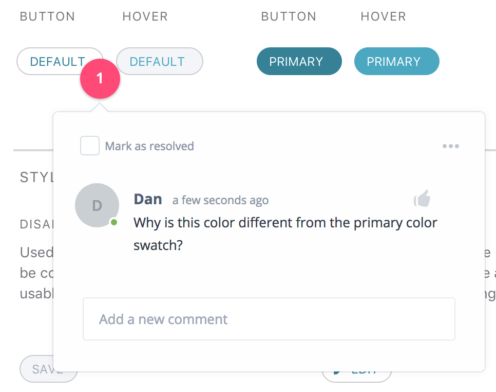

# Design Process

This document outlines the process for work on the Kids First Design system.

## Motivation

It is important to maintain tight coupling of the artistic vision with the
technical implementation of the design system.
Without coupling and rigorously defined process, products across the ecosystem
will diverge in their designs and cause poor user experience, inconsistency of
brand, and heightened development costs to maintain.

## Process

  1) A new component or change is designed using standard design tools
  2) Feedback is given on the design and returned for modification
  3) The design is accepted as final and interpreted as a spec for dev work
  4) The spec is implemented into the design system by a developer
  5) Developers and the designer provide feedback on its imlpementation
  6) The imlpementation of the design is accepted and merged into the design system
  7) Products that consume the design system may immediatly utilize the change

## An Example

The default button style needs to be updated. 

### Proposing a Change or New Component

The change begins with a new design being proposed as an issue.

A proposal for a new component should outline or demonstrate a couple patterns or use cases where it will be effective.

If the component already has existing implementations outside the design system, the issue should motivate why they should be moved into the design system and aggregate the existing variations and propose how to consolidate them.

A new change should motivate why it is necessary and detail what impacts it will have and how to address them, if needed.

### Iteration on the Design Spec

Comments are made within invision/zeplin by designers and developers:

The design is considered ready for implementation once sign-off is obtained from the primary designer and implementation developer.

### Implementation into the Design System

The change is made to the design system to incorporate the new style into the design system standard.
A pull request containting the changes is made for review by stake holders consisting of at least the designer and a developer.

### The Proposal for the New Standard

The changes will be previewable in the storybook for the PR on netlify under the pull request status checks.

The storybook will act as the primary documentation for the use and implementation of the design system.
It is thus vital that the presentation of the story be adequet for developer use.

The pull request will be reviewed based on:

  - The implementation's consistency with the original design in the issue
  - Sufficient documentation of the component in the storybook
  - Conflict with other components and styles
  - Code quality

### Iteration on the Implementation

Changes to the implementation may be requested in the pull request.

### Becoming the new standard

Once the pull request has been approved by the designer and at least on developer, it may be merged into the design system.

### Incorporation to Apps

At this point, the latest component library and stylesheet will be available for application developers to use.
Applications should aim to upgrade as quickly as possible, or even pin their dependency to the latest release so that all implementations will remain consistent.

